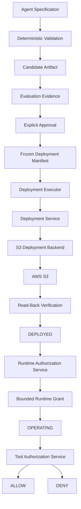

# Agent Foundry

> **How do you scale AI autonomy without scaling risk at the same rate?**

Agent Foundry is a governance system for autonomous AI agents.

It controls how an agent moves from a request to an approved deployment, and then controls exactly what that agent is allowed to do after deployment.

Its central rule is simple:

> **Capability is not authority.**

An agent may be able to perform an action without being authorized to perform it.

Agent Foundry makes that distinction explicit by separating specification, validation, construction, evaluation, approval, deployment, runtime authority, and tool permission into distinct trust boundaries — with evidence preserved at every consequential step.

---

## In Plain English — The 30-Second Version

AI agents are becoming increasingly capable.

The harder enterprise question is not:

> **Can the agent do this?**

It is:

> **Should the agent be allowed to do this, under what conditions, and what evidence proves that authority existed?**

Agent Foundry creates a controlled path from an agent request to an operating agent:

```text
REQUEST
   ↓
VALIDATE
   ↓
BUILD
   ↓
EVALUATE
   ↓
APPROVE
   ↓
FREEZE EVIDENCE
   ↓
DEPLOY
   ↓
VERIFY REALITY
   ↓
ISSUE RUNTIME AUTHORITY
   ↓
OPERATE
```

At every boundary, the system distinguishes between **what is technically possible** and **what has actually been authorized**.

That means:

- passing an evaluation does not approve deployment
- approval does not prove deployment occurred
- deployment does not grant runtime authority
- having access to a tool does not mean the agent may use it
- policy defines the maximum possible authority; an explicit grant defines what was actually issued

Think of Agent Foundry as a controlled manufacturing and promotion line for autonomous capability.

The agent can become more capable.

It cannot quietly become more powerful.

---

## Why I Built It

A great deal of AI governance is discussed as policy.

Agent Foundry explores a different question:

> **What would governance look like if the architecture itself had to enforce it?**

The project is built around deliberately strict principles:

> **An agent specification is not permission to launch an agent.**

> **Creating an agent does not authorize that agent to operate.**

> **Evaluation is evidence. Approval is authority.**

> **A successful API call is not deployment evidence. Verified external state is deployment evidence.**

> **The system may be conservatively behind reality. It must never be optimistically ahead of reality.**

The goal is not to create the largest agent framework.

The goal is to prove that autonomous capability can move through increasingly consequential trust boundaries **without authority being granted by accident**.

---

## What Was Proven

Agent Foundry is not only a local architecture exercise.

The complete DEV lifecycle has been executed against real AWS infrastructure through GitHub Actions.

The final live proof demonstrated:

```text
399 tests pass
        ↓
validation job completes without OIDC authority
        ↓
live job becomes eligible for GitHub OIDC
        ↓
bounded DEV AWS role is assumed
        ↓
frozen deployment manifest is recovered by digest
        ↓
approval is independently retrieved
        ↓
deployment authority is revalidated
        ↓
exact artifact is written to S3
        ↓
artifact is read back
        ↓
exact bytes are verified
        ↓
DeploymentAttempt SUCCESS is recorded
        ↓
lifecycle becomes DEPLOYED
        ↓
successful deployment evidence is independently retrieved
        ↓
bounded RuntimeGrant is issued
        ↓
lifecycle becomes OPERATING
        ↓
files/read    → ALLOW
search/query  → DENY
```

The final GitHub Actions proof completed successfully:

| Proof | Result |
| --- | --- |
| Workflow | `Live governed DEV deployment` |
| Run | [35525913401](https://github.com/TAM-DS/agent-foundry/actions/runs/35525913401) |
| Tests | **399 passed** |
| Environment | `DEV` |
| Deployment outcome | `SUCCESS` |
| Final lifecycle | `OPERATING` |
| Granted permission | `files/read` |
| Policy-permitted but ungranted permission | `search/query → DENY` |

### Final live evidence

| Evidence | Digest / Result |
| --- | --- |
| Artifact | `195cae3e3fbc47a14cde08413049595c5adc4df70fb52ea8cd2c33375a22e300` |
| Deployment manifest | `5b79ad6de387f0d320ca9b6a237ed02522ebe7047ce7a8580dbfd95777c57dc1` |
| Approval | `2a7421f7de70a9e7ed60de0d9baed8f3817b286b104ea03a0f7c8afb896f2e18` |
| Deployment attempt | `b91a997f82dd0ec6ff15d4350327107d4595cef8ed977479c7f7e3f9767e50f7` |
| Runtime policy | `1cc446b030dbab37158f03f44b646bf7ef923471af0706f33899fb141f4c9bbe` |
| Runtime grant | `41a1a6bd74ec34eaf8e1831a3c5dc9ab6368c1ac6919be07dd16c7aeaf531763` |
| `files/read` decision | `ALLOW` |
| `search/query` decision | `DENY` |
| Final state | `OPERATING` |

The deployed content-addressed artifact remains in the DEV S3 evidence boundary at:

```text
dev/artifacts/195cae3e3fbc47a14cde08413049595c5adc4df70fb52ea8cd2c33375a22e300.json
```

---

## Architecture



The important part is not the number of components.

It is **who is allowed to decide what**.

---

## Trust Boundaries

### 1. Specification

A specification describes requested capability.

It is not authority.

A request can ask for a tool, environment, or behavior without automatically receiving permission to use it.

### 2. Validation

Specifications are evaluated against deterministic policy.

A model may help interpret intent or construct candidate material.

It does not decide whether its own request satisfies governance policy.

### 3. Build

Only a validated specification may produce an `AgentArtifact`.

The artifact is content-addressed.

Evaluation, approval, deployment, and runtime evidence bind to the exact artifact identity.

Change the artifact and prior authority no longer applies.

### 4. Evaluation

Evaluation produces evidence.

It does **not** produce approval.

```text
PASS ≠ APPROVED
```

Failed evaluation attempts remain evidence even if a later attempt succeeds.

### 5. Approval

Approval is recorded separately from evaluation.

Approval binds to:

- the exact artifact
- evaluation evidence
- evaluation policy
- target environment
- approver provenance

An approval for one artifact cannot authorize another.

Approver identity is provenance metadata in Agent Foundry. Authentication of that actor remains external to this v1 system.

### 6. Frozen Deployment Evidence

Before execution, the deployment inputs are frozen into a canonical `DeploymentManifest`.

The manifest contains the exact:

- artifact
- evaluation policy
- evaluation evidence
- deployment policy
- target environment
- approval reference

The caller later executes using only:

```python
execute(manifest_digest)
```

It cannot substitute a different artifact, environment, approval, or policy at execution time.

> **The caller chooses which frozen package to execute. It does not get to redefine what that package contains.**

The manifest is evidence.

It is not authority.

`DeploymentService` still independently retrieves the authoritative approval and revalidates the chain before execution.

### 7. Deployment

A deployment attempt does not become `DEPLOYED` merely because execution started.

The sequence is:

```text
APPROVED
   ↓
backend executes
   ↓
external result is verified
   ↓
SUCCESS evidence is persisted
   ↓
DEPLOYED
```

If the backend fails:

```text
APPROVED
   ↓
DeploymentAttempt FAIL
   ↓
remains APPROVED
```

This matters because:

> **A successful API call is not deployment evidence. Verified external state is deployment evidence.**

### 8. Runtime Authority

Deployment does not automatically authorize operation.

```text
DEPLOYED ≠ OPERATING
```

`RuntimeAuthorizationService` independently retrieves successful deployment evidence before it may issue a `RuntimeGrant`.

Only after that grant is durably recorded does the lifecycle advance to:

```text
OPERATING
```

### 9. Tool Authority

Runtime policy and runtime authority are deliberately different.

In the live proof:

```text
RuntimePolicy permits:
    files/read
    search/query
```

But the issued grant contains only:

```text
files/read
```

The result:

```text
files/read    → ALLOW
search/query  → DENY
```

`search/query` is not denied because policy forbids it.

Policy permits it.

It is denied because that authority was **never actually granted**.

> **Policy defines the ceiling. The grant defines the authority actually issued.**

---

## Evidence Before State

Agent Foundry separates **attempts** from **lifecycle state**.

A failed action is still evidence.

It simply does not earn a state transition.

Examples:

```text
BUILT
→ EvaluationAttempt FAIL
→ remains BUILT
```

```text
APPROVED
→ DeploymentAttempt FAIL
→ remains APPROVED
```

```text
OPERATING
→ ToolAuthorizationDecision DENY
→ remains OPERATING
```

This produces one of the system's most important invariants:

> **Failure must remain truthful.**

A later successful action does not erase an earlier failure.

---

## Identity Is Not Authority

GitHub Actions authenticates to AWS through OpenID Connect.

No long-lived AWS access keys are stored in the repository.

But successful federation alone grants no resource capability.

```text
GitHub identity
      ↓
AWS verifies exact OIDC trust
      ↓
temporary role session
      ↓
bounded IAM policy
      ↓
permitted operation
```

Agent Foundry deliberately separates:

```text
identity ≠ resource ≠ authority
```

The DEV role is allowed only:

```text
s3:GetObject
s3:PutObject
```

against:

```text
arn:aws:s3:::agent-foundry-deployment-artifacts-276713393004-us-east-1/dev/*
```

It has no authority to:

- write into `prod/*`
- write into `test/*`
- list the artifact bucket
- list AWS buckets
- delete deployment artifacts
- modify IAM
- access Terraform state
- assume additional deployment authority

Those negative boundaries were tested live.

Allowed operations succeeded.

Out-of-scope operations failed with `AccessDenied`.

---

## CI/CD Authority Is Sequenced Too

The live workflow intentionally uses two separate jobs.

```text
VALIDATE JOB
contents: read
NO id-token authority
        ↓
399 tests pass
        ↓
LIVE-PROOF JOB
DEV environment
id-token: write
        ↓
OIDC federation
        ↓
bounded AWS authority
```

This distinction is intentional.

Putting an AWS credential step after tests is not enough if the test job was already eligible to request cloud identity.

So Agent Foundry enforces:

> **Code must prove itself before it becomes eligible to request deployment identity.**

Or more generally:

> **Ordering operations is not enough. Authority itself must be sequenced.**

---

## Durable Evidence

SQLite acts as the trusted local evidence boundary for the v1 governance proof.

Consequential records are immutable, content-addressed, and append-only in behavior.

Persisted evidence includes:

- approvals
- deployment manifests
- deployment attempts
- runtime grants
- tool authorization decisions
- lifecycle transitions

Records are reconstructed from canonical serialized content and revalidated against their expected digest.

Corrupted, malformed, noncanonical, or conflicting evidence is rejected rather than silently normalized.

This supports another design rule:

> **Compatible data is not necessarily canonical evidence.**

---

## AWS Infrastructure

Terraform defines only the infrastructure needed to prove the trust boundaries.

There is intentionally no compute fleet and no cloud-service bingo.

The AWS footprint consists primarily of:

- hardened S3-backed Terraform state
- GitHub OIDC identity federation
- isolated DEV / TEST / PROD role identities
- a hardened S3 deployment-artifact boundary
- narrowly scoped DEV artifact authority

TEST and PROD deployment identities remain permissionless.

DEV receives only the minimum capability required for the demonstrated operation.

The infrastructure is separated into independent Terraform roots so identity, resource existence, and resource authority remain distinct decisions.

---

## Repository Structure

```text
agent-foundry/
├── src/agent_foundry/
│   ├── domain/          # Immutable governance records and identities
│   ├── services/        # Deterministic authority boundaries
│   ├── persistence/     # Durable canonical evidence
│   ├── adapters/        # External execution mechanisms
│   ├── composition/     # Technology-specific dependency wiring
│   └── verification/    # End-to-end live proof
│
├── infra/
│   ├── bootstrap/             # Durable Terraform state boundary
│   ├── identity/              # GitHub OIDC / AWS role identities
│   ├── deployment-artifacts/  # S3 artifact boundary
│   └── deployment-authority/  # Narrow DEV IAM authority
│
├── tests/                # Governance and failure-path evidence
├── .github/workflows/    # OIDC verification + governed live deployment
├── ARCHITECTURE.md       # Detailed design model
├── AGENTS.md             # Engineering governance contract
├── pyproject.toml
└── uv.lock
```

---

## Technology

| Layer | Technology |
| --- | --- |
| Language | Python 3.13 |
| Dependency management | uv |
| Testing | pytest |
| AWS SDK | boto3 / botocore |
| Evidence persistence | SQLite |
| Infrastructure as Code | Terraform |
| Cloud | AWS |
| CI/CD | GitHub Actions |
| CI → AWS identity | GitHub OIDC |
| Deployment evidence | Amazon S3 |
| Cloud authority | AWS IAM |

---

## Testing Philosophy

The project does not treat a green happy path as sufficient evidence.

Tests intentionally attack the trust boundaries.

Examples include:

- unvalidated specifications cannot be built
- failed evaluation cannot satisfy approval
- passing evaluation does not create approval
- approval for one artifact cannot authorize another
- fabricated evidence cannot authorize deployment
- a caller cannot override a frozen manifest at execution
- failed backend execution remains `APPROVED`
- byte-mismatched S3 readback is deployment failure
- missing deployment evidence cannot issue runtime authority
- runtime grant failure cannot produce `OPERATING`
- policy-permitted but ungranted tools are denied
- corrupted persisted evidence is rejected
- unexpected exceptions are not converted into false success

The final v1 suite contains:

```text
399 tests
```

The goal is not test-count theater.

The goal is to make important architectural claims executable.

---

## What Agent Foundry Does Not Claim

Agent Foundry v1 deliberately does **not** attempt to prove:

- autonomous production promotion
- a production-scale distributed governance database
- human identity authentication inside Agent Foundry itself
- persistent agent compute
- Kubernetes orchestration
- support for every cloud
- support for every model provider
- arbitrary plugin ecosystems
- maximum agent scale
- unrestricted self-modification

`approver_id` and `grantor_id` are provenance metadata supplied by externally authenticated context. In the live proof, that context is GitHub.

`OPERATING` means that explicit runtime authority has been issued and deterministic tool authorization is enforceable.

It does not mean a persistent EC2, Lambda, or Kubernetes workload has been launched.

Those boundaries are intentional.

The project is trying to prove one narrower and more important proposition:

> **Autonomous capability can be created, promoted, deployed, and authorized without allowing capability to become authority by accident.**

---

## Design Principles

1. **Capability is not authority.**
2. **Evaluation is evidence. Approval is authority.**
3. **Identity is not permission.**
4. **Resource existence does not imply authority to use the resource.**
5. **A manifest preserves reviewed intent; it does not manufacture authority.**
6. **Execution consumes frozen evidence rather than reconstructed intent.**
7. **External reality must be verified before lifecycle state advances.**
8. **Deployment is not runtime authority.**
9. **Policy defines the ceiling; explicit grants define actual authority.**
10. **Tool availability does not imply tool permission.**
11. **Failures remain evidence.**
12. **Authority itself must be sequenced.**
13. **The system may be conservatively behind reality. It must never be optimistically ahead of reality.**

---

## The Result

Agent Foundry began with a question:

> **How do you scale autonomy without scaling risk at the same rate?**

The answer was not another agent.

It was a system of boundaries.

A model may reason.

An artifact may exist.

An evaluation may pass.

An actor may approve.

A deployment may succeed.

A policy may permit an action.

None of those facts automatically grants the next authority.

Each consequential transition must earn its own evidence.

Each authority must be explicit.

And when the system claims that something is operating, it can show **what was built, what was evaluated, what was approved, what was deployed, what was verified, what authority was granted, and what the agent was actually allowed to do.**

That is Agent Foundry.
